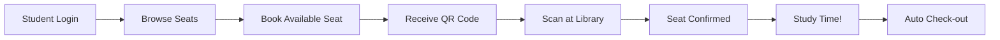

# 🪑 SeatFinderSRM

### *Find Your Perfect Study Spot*

A modern, real-time seat booking system for SRM University libraries, built with Next.js and Firebase.

## ✨ Features

### 🔐 **Secure Authentication**
- **SRM-Exclusive Access**: Only `@srmist.edu.in` email addresses allowed
- **Email Verification Required**: Ensures only verified students can book seats
- **Secure Firebase Auth**: Industry-standard authentication

### 🗺️ **Interactive Seat Map**
- **Real-time Updates**: See seat availability instantly across all floors
- **Visual Status Indicators**: 
  - 🟢 Available - Ready to book
  - 🟡 Booked - Reserved but not checked in
  - 🔴 Occupied - Currently in use
- **Floor Navigation**: Easy switching between library floors

### ⏱️ **Smart Booking System**
- **Timed Reservations**: Book seats for specific durations
- **Confirmation Window**: 15-minute grace period to check in
- **Anti-Hoarding Protection**: Automatic cancellation of unconfirmed bookings
- **Booking History**: Track all your past and current bookings

### 📱 **QR Code Check-in**
- **Unique QR Codes**: Each booking generates a scannable QR code
- **Quick Check-in**: Scan at library entrance to confirm your seat
- **Admin Scanner**: Staff interface for seamless check-in/check-out management

### 🔄 **Self-Healing System**
- **Auto-Cleanup**: Expired bookings automatically freed
- **Overstay Detection**: Seats released after booking duration ends
- **Real-time Sync**: All changes reflected instantly across all devices

### 🎨 **Modern UI/UX**
- **Responsive Design**: Perfect on desktop, tablet, and mobile
- **Dark/Light Mode**: Easy on the eyes, day or night
- **Smooth Animations**: Fluid transitions and interactions
- **Accessible**: Built with accessibility in mind

## 🎯 How It Works

### 📝 User Flow

1. **Sign Up/Login** with your `@srmist.edu.in` email
2. **Verify Email** via the link sent to your inbox
3. **Browse Seats** on the interactive floor map
4. **Book a Seat** for your desired duration
5. **Get QR Code** instantly after booking
6. **Check In** by scanning QR at library entrance
7. **Study** in your reserved seat
8. **Auto Check-out** when time expires or manually check out

## 📊 System Capacity

- **Concurrent Users**: Supports 10,000+ simultaneous users
- **Daily Bookings**: Handles 10-15k bookings per day
- **Real-time Updates**: Sub-second latency for seat status changes
- **Uptime**: 99.9% availability with Firebase infrastructure

## 🤝 Contributing

We welcome contributions! Here's how you can help:

1. 🍴 Fork the repository
2. 🌿 Create a feature branch (`git checkout -b feature/AmazingFeature`)
3. 💾 Commit your changes (`git commit -m 'Add some AmazingFeature'`)
4. 📤 Push to the branch (`git push origin feature/AmazingFeature`)
5. 🔃 Open a Pull Request

## 👥 Contributors

<table>
<tr>
<td align="center">
<a href="https://github.com/nidhi-nayana">
 
<b>Nidhi Nayana</b>
</a>
</td>
<td align="center">
<a href="https://github.com/tanishpoddar">
 
<b>Tanish Poddar</b>
</a>
</td>
<td align="center">
<a href="https://github.com/nishant-codess">
 
<b>Nishant Ranjan</b>
</a>
</td>
</tr>
</table>

## 📄 License

This project is licensed under the **GNU General Public License v3.0** - see the [LICENSE](LICENSE) file for details.

### ⭐ Star us on GitHub — it motivates us a lot!

Made with ❤️ by SRM Students, for SRM Students

[⬆ Back to Top](#-seatfindersrm)

